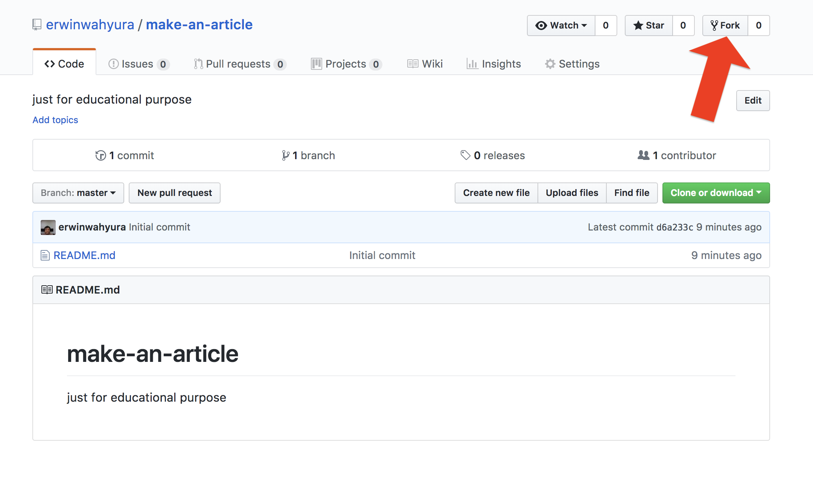
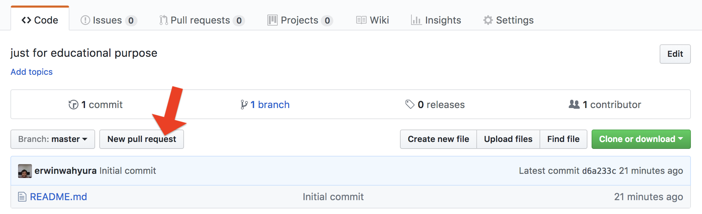
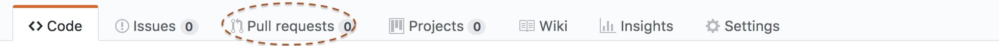

# make-an-article
in this case you will make a great article about javascript here is the list about the article

examples:

1. asynchronous
2. callback
3. promise

## How To Fork

1. open the `repository` that you want to fork, in this case you will use [make-an-article](https://github.com/erwinwahyura/make-an-article)
2. click button `fork` on the top right side of your monitor  it will directly copy this `repository` to your `repository`
3. clone the repository that has you fork on your repository github
4. how to clone (kalo masih pada lupa)
5. open the `repository` that has you clone in your local (laptop)
6. create 3 article / blog on your `markdown` `.md` write it and push to github
7. after you have done with your article you should pull request

## How To Pull Request
1. this below is how to `pull request`

2. create pull request
3. open this and look `pull request` on this repository
4. you will see your `pull request` on here

5. in that case is still `0` but if you did `pull request` it will turn into 1 and many more
6. dont know how to write markdown ? here is the cheatsheet link [markdown cheatsheet](https://github.com/adam-p/markdown-here/wiki/Markdown-Cheatsheet)
